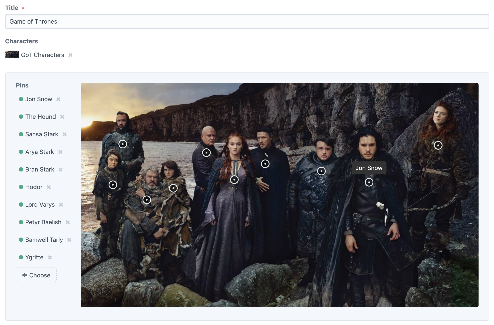

# Donkeytail plugin for Craft CMS 3.x

Donkeytail is a Craft CMS 3 fieldtype that allows you to quickly and easily content manage element points on images. You can use it for locations on a faux map, showcasing multiple products within an image, or even pinning the tail on a donkey.



Follow the [@simplygoodwork](https://twitter.com/simplygoodwork) Twitter account for updates.

## Requirements

This plugin requires Craft CMS 3.5.6 or later.

## Installation

To install the plugin, follow these instructions.

1.  Open your terminal and go to your Craft project:

        cd /path/to/project

2.  Then tell Composer to load the plugin:

        composer require simplygoodwork/craft-donkeytail

3.  In the Control Panel, go to Settings → Plugins and click the “Install” button for Donkeytail.

## Usage

### Terminology

In Donkeytail, the image asset you’re adding points to is called the _canvas_ and the point entries you’re adding are called _pins_.

### Templating

The following attributes are available from your donkeytail field:

- `canvas`: The canvas asset element.

- `pins`: Array of pins attached to canvas:

  - `element`: The pin element.

  - `x`: The left percentage value of the pin's anchor point in relation to the canvas (without % suffix).

  - `left`: The left percentage value of the pin's anchor point in relation to the canvas (with % suffix).

  - `y`: The top percentage value of the pin's anchor point in relation to the canvas (without % suffix).

  - `top`: The top percentage value of the pin's anchor point in relation to the canvas (with % suffix).

  - `style`: Returns the top and left percentages as CSS style properties and values.
    - For example `top: 42.121%; left: 88.1337%;`.

### GraphQL

The following attributes are available from your donkeytail field when accessed via graphql:

- `canvas`: The canvas asset element.

- `pins`: Pins attached to canvas:

  - `x`: The left percentage value of the pin's anchor point in relation to the canvas (without % suffix).

  - `y`: The top percentage value of the pin's anchor point in relation to the canvas (without % suffix).

- {`entry`, `asset`, `user`, `category`, `product`, `variant`}: The pin element.

### Real world example

You’ll need to render the canvas asset yourself as you normally would within a template.

A real world example would likely have the canvas in a parent container with `position: relative`. The dots can then be set to `position: absolute` and their positions output using an inline style attribute and `{{ entry.donkeytailField.style }}`. Don't forget to use negative margins or similar to move your frontend marker’s point to the match the anchor point of the dot, and to replace `{donkeytailField}` with your Donkeytail Field handle:

```
<div style="width: 50%; position: relative;">
  
  
    <div style="position: absolute; z-index: 10; width: 10px; height: 10px; background-color: red; top:{{ pin.y }}%;left:{{ pin.x }}%;"></div>
  
</div>
```

Or, if you want to show captions by default:

```
<div style="width: 50%; position: relative;">
  
  
    <div style="position: absolute; z-index: 10; width: 10px; height: 10px; background-color: red; top:{{ pin.y }}%;left:{{ pin.x }}%;"></div>
    <div style="position: absolute; z-index: 10; background-color: rgba(0,0,0,.8); color: white; top:{{ pin.y }}%;left:{{ pin.x }}%;transform:translate(-50%, 100%);">
      {{ pin.element.title }}
    </div>
  
</div>
```

---

Brought to you by [Good Work](https://simplygoodwork.com). Happy Pinning!
